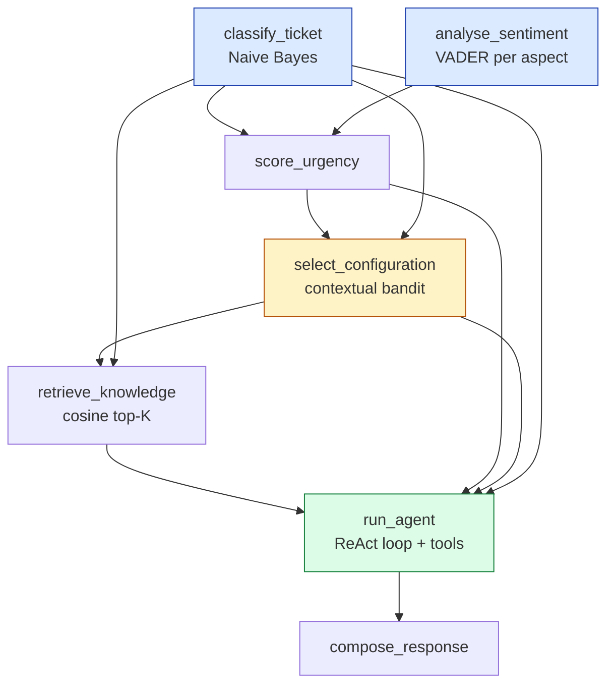

# TicketIQ — Self-Optimizing Support Triage Agent

A back-end service that triages free-text support tickets end to end: it
classifies the ticket with a hand-written Naive Bayes model, scores sentiment
**per product aspect**, retrieves the relevant policy from a knowledge base,
reasons with a ReAct agent that can call tools or escalate, and **learns which
pipeline configuration works best** from latency and user feedback using an
online contextual bandit — all orchestrated by a small resumable DAG engine
rather than one monolithic function.

> **Runs with no model server installed.** The language model layer falls back
> to a deterministic offline writer when Ollama is not available, and every
> response says which backend produced it. See
> [Language model setup](#language-model-setup).

| | |
|---|---|
| **Tests** | 237 passing, **99%** coverage of `app/` |
| **Classifier** | 95.0% accuracy / 0.949 macro-F1 on a held-out split |
| **Bandit** | 54% → 76% optimal choices over 5k tickets; **88.8%** at 20k (ε-ceiling is 88.8%) |
| **Console** | An operator UI at `/`, served by the same app — no build step, no new dependency |
| **Stack** | FastAPI · Pydantic · FAISS · scikit-learn · numpy · VADER · SQLite · pytest · black · ruff · mypy · Docker · GitHub Actions |

---

## Table of contents

- [The suggested stack, line by line](#the-suggested-stack-line-by-line)
- [Quick start](#quick-start)
- [The console](#the-console)
- [Architecture](#architecture)
- [API reference](#api-reference)
- [Language model setup](#language-model-setup)
- [Results](#results)
- [Design write-ups](#design-write-ups)
- [Testing](#testing)
- [Repository layout](#repository-layout)
- [Configuration](#configuration)
- [Shortcuts and scope notes](#shortcuts-and-scope-notes)

---

## How this maps to the assignment

| # | Requirement | Where | Status |
|---|-------------|-------|--------|
| 1 | `POST /ticket` returning category, aspect sentiment, snippets, action, response text, config, latency, transaction id | [app/main.py](app/main.py), [app/schemas.py](app/schemas.py) | ✅ |
| 1 | `POST /feedback` updating the RL loop | [app/main.py](app/main.py) → [pipeline.handle_feedback](app/workflow/pipeline.py) | ✅ |
| 1 | `GET /ticket/{id}/status` from real workflow state | reads the same SQLite rows the engine writes | ✅ |
| 2 | Classifier with the maths written by hand, 4 categories | [naive_bayes.py](app/ml/naive_bayes.py) — counting, Laplace smoothing and log-probability scoring written out; `model.fit()` is never called | ✅ |
| 2 | 100–200 labelled tickets, accuracy / precision / recall / F1 on a held-out split | [data/tickets.json](data/tickets.json) (160), scored with `sklearn.metrics`, `scripts/train_and_report.py` | ✅ 95.0% / 0.949 F1 |
| 2 | 1–3 aspects per ticket, scored independently | [aspect_sentiment.py](app/ml/aspect_sentiment.py) — keyword + phrase spotting, VADER per sentence, `general` fallback so there is always ≥1 | ✅ |
| 2 | Urgency from category + sentiment + tier | [urgency.py](app/ml/urgency.py) | ✅ |
| 3 | 4–6 markdown knowledge base documents | [data/knowledge_base/](data/knowledge_base/) — 5 documents, 28 chunks | ✅ |
| 3 | Vector store, chunk + embed + top-K | [vector_store.py](app/rag/vector_store.py) — **FAISS** `IndexFlatIP` over TF-IDF vectors | ✅ |
| 3 | Two distinct LLM configurations | [configs.py](app/llm/configs.py) — two prompt variants, each on its own Ollama model, 4 bandit arms with top-K | ✅ verified against live models: all four arms produce distinct replies, and holding the model fixed while swapping only the prompt changes output 319 → 816 chars |
| 4 | ReAct loop choosing answer / tool / escalate | [react_agent.py](app/agent/react_agent.py) — verified against live models; one policy invariant (never escalate a feature request) is enforced on all three escalation paths and the override is recorded in the trace | ✅ |
| 4 | Mock `check_account_status` and `check_refund_eligibility` | [tools.py](app/agent/tools.py) | ✅ |
| 4 | Decision, tool calls and trace in the response **and in logs** | returned by `POST /ticket`; logged by the `ticketiq.agent` logger | ✅ |
| 5 | Lightweight online learner, no deep network | [bandit.py](app/rl/bandit.py) — epsilon-greedy contextual bandit | ✅ |
| 5 | State = category + urgency + tier | [state.py](app/rl/state.py) — 36 states | ✅ |
| 5 | Action = prompt config and/or RAG top-K | both: 2 variants × 2 top-K = 4 arms | ✅ |
| 5 | Reward = feedback × 10 − latency | [state.py](app/rl/state.py) — verified numerically against the formula | ✅ |
| 5 | Experiment showing the distribution shift | `scripts/simulate_bandit.py` — 54% → 89% optimal; also demonstrated through the real pipeline, 40 tickets | ✅ |
| 6 | Named stages with declared dependencies (DAG) | [dag.py](app/workflow/dag.py), [pipeline.py](app/workflow/pipeline.py) — 7 stages | ✅ |
| 6 | Per-ticket, per-stage state persisted | [state_store.py](app/workflow/state_store.py) — SQLite | ✅ |
| 6 | Inspectable mid-flight | proved by `test_the_pipeline_can_be_inspected_while_it_is_still_running` | ✅ |
| 6 | Failed stage re-runnable without repeating upstream | `POST /ticket/{id}/retry` | ✅ |
| 6 | Two independent stages running concurrently | `classify_ticket` ∥ `analyse_sentiment` — proved with a `threading.Barrier`, and measured at 4.97 ms of real wall-clock overlap on separate threads | ✅ |
| 7 | Type hints, black, ruff, pre-commit | mypy passes `--disallow-untyped-defs` over `app/`; all four wired into `.pre-commit-config.yaml`, verified by actually running `pre-commit run --all-files` | ✅ |
| 7 | Tests: classifier, bandit update rule, dependency resolution, TestClient, E2E with LLM mocked | [tests/](tests/) — 237 tests, 99% coverage | ✅ |
| 7 | Dockerfile + GitHub Actions + local run without Docker | [Dockerfile](Dockerfile), [ci.yml](.github/workflows/ci.yml) | ✅ |
| — | mypy (*"optional but a plus"*) | configured in `pyproject.toml`, enforced in pre-commit and CI | ✅ |

---

## The suggested stack, line by line

The brief's stack list mixes required tools with menus of alternatives. This is
what is actually installed and imported, and what was deliberately left out.

| Brief's line | Used here | Where |
|---|---|---|
| **API:** FastAPI, Uvicorn, Pydantic | all three | `app/main.py`, `app/schemas.py`; Uvicorn is the ASGI server, run from the CLI and the Dockerfile |
| **NLP / ML:** numpy, scikit-learn *(vectorisation/metrics only)*, spaCy, NLTK/VADER, or a HuggingFace pipeline | **numpy**, **scikit-learn**, **VADER** | `app/rag/vector_store.py`, `app/ml/dataset.py`, `app/ml/sklearn_metrics.py`, `app/ml/aspect_sentiment.py` |
| **Agent / RAG framework:** LangChain, LlamaIndex, or native Python | **native Python** — the brief's third option | `app/agent/react_agent.py`, `app/rag/` |
| **Vector store:** FAISS or ChromaDB | **FAISS** (`IndexFlatIP`) | `app/rag/vector_store.py` |
| **Models:** Ollama, or any API-based model | **Ollama**, two models | `llama3.2:1b` + `qwen2.5:1.5b`, verified running |
| **Workflow engine:** a hand-rolled DAG runner, *preferred over* Airflow/Prefect/Celery | **hand-rolled**, 315 lines, stdlib only | `app/workflow/dag.py` |
| **Quality/DevOps:** black, ruff, mypy *(optional)*, pre-commit, pytest, pytest-cov, Docker, GitHub Actions | all eight, including the optional mypy | `pyproject.toml`, `.pre-commit-config.yaml`, `Dockerfile`, `.github/workflows/ci.yml` |

**Deliberately not used**, all of them alternatives inside an "or" in the same
list: spaCy and HuggingFace (VADER is what requirement 2 calls sufficient),
LangChain and LlamaIndex, ChromaDB, and Airflow/Prefect/Celery — which the brief
explicitly prefers to avoid.

**One substitution worth naming.** The brief writes "NLTK/VADER". This uses the
standalone `vaderSentiment` package rather than `nltk.sentiment.vader`. It is
the same algorithm and the same lexicon by the same author; the standalone
package just avoids pulling in NLTK and its corpus download.

**No dependency is declared but unused.** Every line of `requirements.txt` and
`requirements-dev.txt` is either imported by the code or run as a command-line
tool — checked by walking the import graph, after `numpy` was once found sitting
in the file unused.

---

## Quick start

### Without Docker

Requires Python 3.10 or newer.

```bash
# 1. clone and enter the repository
cd TicketIQ

# 2. create and activate a virtual environment
python -m venv .venv
source .venv/bin/activate        # Windows: .venv\Scripts\activate

# 3. install dependencies
pip install -r requirements.txt -r requirements-dev.txt

# 4. run the service
uvicorn app.main:app --reload
```

Then open **<http://localhost:8000/>** — the console, where you can triage
tickets and rate the answers. <http://localhost:8000/docs> is the interactive
API documentation.

From the command line:

```bash
curl http://localhost:8000/health
```

```json
{"ready":true,"llm_backend":"template","knowledge_chunks":28,
 "classifier_accuracy":0.95,"bandit_updates":0}
```

Nothing needs to be trained or downloaded first: the classifier trains at
startup from `data/tickets.json` (milliseconds) and the knowledge base is
indexed in memory.

### With Docker

```bash
docker build -t ticketiq .
docker run --rm -p 8000:8000 ticketiq
```

To keep the learned bandit statistics and workflow history between runs, mount
the runtime folder:

```bash
docker run --rm -p 8000:8000 -v "$(pwd)/var:/service/var" ticketiq
```

### Run the experiments

```bash
python scripts/train_and_report.py     # classifier metrics on a held-out split
python scripts/simulate_bandit.py      # RL simulation: does the bandit learn?
python data/generate_tickets.py        # regenerate the labelled dataset
```

---

## The console

Open **<http://localhost:8000/>** once the service is running. It is three
static files (`app/static/`) served by the same FastAPI process — same origin,
no CORS setup, no `npm install`, no build step, no extra Python dependency.
Full notes in [app/static/README.md](app/static/README.md).

The page answers one question — *what should happen to this ticket?* — so the
suggested reply is the biggest thing on it, and the justification sits in
collapsed sections:

| Always visible | Collapsed, one click away |
|----------------|---------------------------|
| Subject, description, customer tier | **Analysis** — sentiment per aspect, and the knowledge base sections quoted |
| Category, urgency, action, handling time | **Agent reasoning** — each step and any tool result |
| The suggested reply | **Processing steps** — the seven stages and their real durations |
| Was this helpful? | **Routing performance** — reward per configuration for this kind of ticket |

Colour is used in three places only — urgency, the action, and sentiment
polarity — and each always shows its word too, so colour is never the only
signal.

### Suggested demo

The four example links fill the form for you, and each takes a different path
through the system:

| Example | What it shows |
|---------|---------------|
| **Outage** | Enterprise + high urgency + technical → the agent **escalates to a human** |
| **Feature request** | Same pipeline, but the agent **answers** — the escalation policy says a missing feature is not an outage |
| **Login problem** | The agent calls `check_account_status` before answering |
| **Duplicate charge** | The agent calls `check_refund_eligibility` before promising any money |

Then rate a reply and open **Routing performance** to see the reward
(`feedback × 10 − latency`) land against the configuration that produced it.

---

## Architecture

Full detail, including the reasoning behind each choice, is in
**[docs/ARCHITECTURE.md](docs/ARCHITECTURE.md)**.

```
        POST /ticket          POST /feedback       GET /ticket/{id}/status
             |                      |                       |
             v                      v                       v
   +--------------------------------------------------------------+
   |                        TriageService                         |
   +--------------------------------------------------------------+
        |                       |                        |
        v                       v                        v
  WorkflowEngine        Contextual bandit        WorkflowStateStore
   (DAG runner)          (epsilon-greedy)             (SQLite)
        |                       ^                        ^
        |  runs stages          | reward                 | real state
        v                       |                        |
  +--------------------------------------------------------------+
  | Naive Bayes | VADER aspects | TF-IDF retriever | ReAct agent  |
  +--------------------------------------------------------------+
```

### The pipeline DAG

Each stage declares its dependencies; the engine derives the order and runs
independent stages concurrently.



| Level | Stages | |
|-------|--------|---|
| 0 | `classify_ticket`, `analyse_sentiment` | **run in parallel** — both read only the raw ticket |
| 1 | `score_urgency` | needs category *and* aspect sentiment |
| 2 | `select_configuration` | the bandit's state is the category + urgency + tier |
| 3 | `retrieve_knowledge` | uses the top-K the bandit chose |
| 4 | `run_agent` | uses the prompt variant the bandit chose |
| 5 | `compose_response` | |

`GET /workflow/graph` returns this live, computed from declared dependencies.

---

## API reference

### `POST /ticket`

Runs the full pipeline.

```bash
curl -X POST http://localhost:8000/ticket \
  -H "Content-Type: application/json" \
  -d '{
    "subject": "Charged twice on order 4471",
    "body": "My credit card was charged twice for the same monthly invoice. I want a refund.",
    "customer_tier": "enterprise"
  }'
```

<details>
<summary>Response (abridged — real output)</summary>

```json
{
  "transaction_id": "tx-f74f7d434acb",
  "category": "billing",
  "category_confidence": 1.0,
  "aspect_sentiments": [
    {"aspect": "billing", "score": 0.0257, "label": "neutral", "mentions": 3,
     "evidence": "Charged twice on order 4471"}
  ],
  "urgency_score": 0.55,
  "urgency_bucket": "medium",
  "retrieved_knowledge": [
    {"chunk_id": "01_billing_refund_policy#2", "source": "01_billing_refund_policy.md",
     "document_title": "Billing and Refund Policy", "heading": "Duplicate charges",
     "text": "If the same amount was charged twice ...", "score": 0.2433},
    {"chunk_id": "01_billing_refund_policy#1", "heading": "Refund window",
     "text": "A customer may request a full refund within 30 days ...", "score": 0.1332}
  ],
  "action": "answer",
  "response_text": "Category: billing. Applicable policy - Duplicate charges: ...",
  "reasoning_trace": [
    {"step": 1,
     "thought": "The customer is asking for money back, so eligibility must be confirmed before anything is promised.",
     "action": "check_refund_eligibility",
     "action_input": {"order_id": "4471"},
     "observation": "order 4471 is eligible for a refund of 79.0 (duplicate charge, refundable regardless of age)"},
    {"step": 2,
     "thought": "The retrieved knowledge base sections cover this question, so it can be answered directly.",
     "action": "answer", "action_input": {}, "observation": ""}
  ],
  "tool_calls": [
    {"tool": "check_refund_eligibility", "arguments": {"order_id": "4471"},
     "output": {"eligible": true, "amount": 79.0, "days_since_charge": 8, "duplicate_charge": true},
     "summary": "order 4471 is eligible for a refund of 79.0 (duplicate charge, refundable regardless of age)"}
  ],
  "pipeline_config": {"name": "concise_policy|k2", "prompt_variant": "concise_policy",
                      "rag_top_k": 2, "model": "qwen2.5:1.5b"},
  "config_selection_reason": "cold_start",
  "rl_state_key": "billing|medium|enterprise",
  "llm_backend": "template",
  "latency_seconds": 0.0822,
  "stages_executed": ["analyse_sentiment", "classify_ticket", "score_urgency",
                      "select_configuration", "retrieve_knowledge", "run_agent",
                      "compose_response"],
  "stages_reused": []
}
```
</details>

`customer_tier` is one of `free`, `pro`, `enterprise` (defaults to `free`).

### `POST /feedback`

Binary feedback. This is what closes the reinforcement learning loop.

```bash
curl -X POST http://localhost:8000/feedback \
  -H "Content-Type: application/json" \
  -d '{"transaction_id": "tx-f74f7d434acb", "feedback_score": 1}'
```

```json
{
  "transaction_id": "tx-f74f7d434acb",
  "feedback_score": 1,
  "latency_seconds": 0.0822,
  "reward": 9.9178,
  "state_key": "billing|medium|enterprise",
  "config_name": "concise_policy|k2",
  "updated_average_reward": 9.9178,
  "best_config_for_state": "concise_policy|k2"
}
```

`reward = feedback_score × 10 − latency_seconds`. Feedback is accepted **once**
per transaction; a repeat returns `409`, since applying it twice would bias the
bandit's averages.

### `GET /ticket/{transaction_id}/status`

Real per-stage state, read from the workflow engine's own store.

```bash
curl http://localhost:8000/ticket/tx-f74f7d434acb/status
```

```json
{
  "transaction_id": "tx-eafcfe7d5f8a",
  "status": "completed",
  "request": {
    "subject": "Charged twice on order 4471",
    "body": "My credit card was charged twice for the same monthly invoice. I want a refund.",
    "customer_tier": "enterprise"
  },
  "completed_stages": 7,
  "total_stages": 7,
  "stages": [
    {"stage": "analyse_sentiment", "status": "completed", "error": "", "duration_seconds": 0.0103,
     "output": {"aspects": [{"aspect": "billing", "score": 0.0257, "label": "neutral",
                             "mentions": 3, "evidence": "Charged twice on order 4471"}]}},
    {"stage": "classify_ticket", "status": "completed", "error": "", "duration_seconds": 0.011,
     "output": {"category": "billing", "confidence": 1.0,
                "scores": {"account": -104.2556, "billing": -73.6724,
                           "feature_request": -103.9027, "technical": -115.9191}}},
    {"stage": "score_urgency", "status": "completed", "error": "", "duration_seconds": 0.004,
     "output": {"urgency_score": 0.55, "urgency_bucket": "medium"}}
  ],
  "not_started_stages": [],
  "feedback_score": 1,
  "reward": 9.9304
}
```

*(Abridged: the four remaining stages are omitted. The stage list is ordered by
start time, which is why the two parallel level-0 stages appear first.)*

When a stage fails, its row shows `"status": "failed"` with the error message,
everything downstream shows `"skipped"`, and the completed stages upstream keep
their outputs — which is exactly what makes a retry cheap.

### `POST /ticket/{transaction_id}/retry`

Re-runs a ticket whose pipeline failed, **reusing every stage that already
succeeded**. This is the resumable half of the workflow engine made usable.

```bash
curl -X POST http://localhost:8000/ticket/tx-f74f7d434acb/retry
```

The response is the same shape as `POST /ticket`, and its two bookkeeping
fields show that the upstream work was not repeated:

```json
{
  "stages_reused":   ["classify_ticket", "analyse_sentiment", "score_urgency",
                      "select_configuration"],
  "stages_executed": ["retrieve_knowledge", "run_agent", "compose_response"]
}
```

Returns `404` for an unknown transaction and `409` if the ticket already
completed, since there is then nothing to retry.

### Inspection endpoints

| Endpoint | Returns |
|----------|---------|
| `GET /health` | readiness, the live LLM backend, chunk count, classifier accuracy |
| `GET /rl/stats` | everything the bandit has learned, per state and per arm |
| `GET /workflow/graph` | the DAG, level by level, showing what runs in parallel |
| `GET /ml/report` | the held-out classifier evaluation and confusion matrix |
| `GET /docs` | interactive OpenAPI documentation |

### Error handling

| Status | When |
|--------|------|
| `422` | invalid tier, empty subject/body, feedback score outside {0, 1} |
| `404` | unknown transaction id |
| `409` | feedback already recorded for that transaction |
| `500` | a pipeline stage failed — the body carries the `transaction_id` and `failed_stage` so the status endpoint can be inspected |

---

## Language model setup

The RL layer needs a genuine choice between configurations, so there are two
distinct prompt variants, **each mapped to its own model**:

| Variant | System instruction | Model |
|---------|--------------------|-------|
| `concise_policy` | at most four sentences, quote the exact policy rule, no pleasantries | `qwen2.5:1.5b` |
| `empathetic_stepwise` | acknowledge impact, numbered next steps, say who owns it | `llama3.2:1b` |

**Which model serves which variant was measured, not guessed.** Asked to produce
numbered next steps, `llama3.2:1b` complied in 3 runs out of 3 and
`qwen2.5:1.5b` in 0 out of 3 — it quietly ignored the instruction. So the
step-by-step variant gets the model that can actually follow it. Both handle
the concise variant equally well, so Qwen takes that one. Holding the model
fixed and varying only the system prompt changes the output substantially
(319 → 816 characters on Llama), which is what makes these two genuinely
distinct configurations rather than two labels.

Combined with RAG top-K of 2 or 5, that is the bandit's four-arm action space.

### Running against real models

```bash
ollama serve                    # in its own terminal
ollama pull qwen2.5:1.5b        # 1.0 GB — serves concise_policy
ollama pull llama3.2:1b         # 1.3 GB — serves empathetic_stepwise
uvicorn app.main:app            # TICKETIQ_LLM_BACKEND defaults to "auto"
```

`GET /health` will then report `"llm_backend": "ollama"` instead of
`"template"`.

These two defaults are deliberately small — 2.3 GB together, so the setup above
takes minutes — and both are from families the brief names. Point them at
anything Ollama serves without touching the code:

```bash
TICKETIQ_OLLAMA_MODEL_A=llama3 TICKETIQ_OLLAMA_MODEL_B=mistral uvicorn app.main:app
```

**What to expect at this size.** Warm calls take 2–4 s each, so a ticket
completes in roughly 6–20 s against the template writer's 0.1 s. Cold starts are
much slower — 60–130 s — because Ollama is also loading the weights, and there
are **two** models here, so expect that twice: once for whichever the bandit
picks first, and again the first time it explores the other one. That is why
`TICKETIQ_LLM_TIMEOUT` defaults to 120 s. A 1 B
model also reasons visibly less well than a 7 B one: it will occasionally ask
for a tool call it has already made (the agent detects this and replays the
earlier result instead of re-running the tool) and its prose sometimes
describes an escalation when it chose to answer. Both improve markedly with
`llama3`/`mistral`.

### Without Ollama

The service uses `TemplateBackend`, which composes the reply from the retrieved
policy chunks, the chosen prompt variant and the tool results. It is not a
fixed-string stub — the two variants produce visibly different replies, so the
pipeline, the latency measurement and therefore the reward signal stay
meaningful.

**Every response carries `llm_backend`**, and it names *every* backend that
served the ticket, not just the last one: a ticket whose decision timed out but
whose reply came from the model reports `"ollama+template"`. Template output can
never be mistaken for model output.

This is what lets the test suite and CI run offline and deterministically.

---

## Results

### Classifier (`python scripts/train_and_report.py`)

160 synthetic tickets, stratified 75/25 split, Multinomial Naive Bayes
implemented from scratch:

```
accuracy       : 0.950
macro precision: 0.958
macro recall   : 0.950
macro F1       : 0.949

category          precision  recall     f1         support
account           1.000      1.000      1.000      10
billing           1.000      1.000      1.000      10
feature_request   1.000      0.800      0.889      10
technical         0.833      1.000      0.909      10

Confusion matrix (rows = actual, columns = predicted)
                  account   billing   feature_  technica
account           10        0         0         0
billing           0         10        0         0
feature_request   0         0         8         2
technical         0         0         0         10
```

The first version of the dataset scored a perfect 1.000, which means the task
was too easy to be informative. The generator now mixes a second, unrelated
problem into 45% of tickets ("I cannot log in **and** I was charged twice"),
keeping the subject line's category as the label. The three remaining errors are
exactly those genuinely ambiguous tickets.

### Reinforcement learning (`python scripts/simulate_bandit.py`)

The real bandit and the real reward function against a simulated world where
**no arm is globally best** — fast/concise wins on low urgency, slow/thorough
wins on high urgency:

```
Action distribution              first window   last window
concise_policy|k2                24.1%          36.5%
concise_policy|k5                30.4%          25.5%
empathetic_stepwise|k2           16.3%          6.9%      <- abandoned
empathetic_stepwise|k5           29.2%          31.1%

Share of choices that matched the oracle
first window: 54.4%
last window : 75.9%

What the bandit learned
technical|high|enterprise    learned=empathetic_stepwise|k5  oracle=empathetic_stepwise|k5  match
feature_request|low|free     learned=concise_policy|k2       oracle=concise_policy|k2       match
billing|medium|pro           learned=concise_policy|k5       oracle=concise_policy|k5       match
```

At 20,000 tickets the last window reaches **88.8%** optimal choices — the
ceiling for ε = 0.15 — and average reward per ticket rises from 5.66 to ~6.7.
Note the distribution shift is *per state*: `empathetic_stepwise|k5` is not
globally best, it is retained precisely where high urgency makes it best.

---

## Design write-ups

### Reinforcement learning strategy, and why

Choosing a pipeline configuration is a **one-step** decision — pick an arm, get
a reward, and the next ticket is unrelated to this one. There is no sequence of
states to plan through, so Q-learning's discount factors and next-state
bootstrapping would be machinery with nothing to do. A **contextual bandit** is
the exact model for "one decision, immediate reward, and the right answer
depends on context", and it learns from very few samples, which matters when
every sample costs a real customer interaction. A deep network was explicitly
out of scope, and would be the wrong tool for 36 states and 4 arms anyway.

```
state  = category | urgency bucket | customer tier     (4 × 3 × 3 = 36)
action = prompt variant × RAG top-K                    (2 × 2 = 4)
reward = feedback × 10 − latency seconds
```

Everything continuous is bucketed before it reaches the bandit: a raw urgency
of 0.5512 would create a state that never repeats. Selection is **epsilon-greedy
with a cold start** — every arm is tried once per state before any average is
trusted, then 15% of traffic explores. The average updates incrementally
(`avg += (reward − avg) / n`), which equals re-averaging the whole history
without storing it, and the statistics are persisted to `var/bandit_state.json`
so learning survives a restart.

**Trade-off taken knowingly:** 36 states × 4 arms = 144 cells, and binary
feedback is a noisy signal. Full per-state convergence needs thousands of
tickets. Keeping `category` in the state is still the right modelling call
because a feature request and an outage genuinely want different handling — but
a production deployment with low volume should either drop `category` or share
statistics across states with a linear model (LinUCB).

### Workflow engine design

`app/workflow/dag.py` is a ~150-line DAG runner that knows nothing about
tickets. Stages declare dependencies; the engine computes **execution levels**
with Kahn's algorithm, which naturally answers "what may run at the same time".

Four guarantees, each directly tested:

1. **Validated graph** — missing dependency, self-dependency, cycle and
   duplicate name are all rejected at construction, not at run time.
2. **Parallelism where it is free** — same-level stages run on a thread pool.
   The test proves it with a `threading.Barrier` that only passes if two stages
   are genuinely concurrent.
3. **Resumability** — every stage output is persisted as it completes, so a
   re-run loads finished stages instead of recomputing them. A failed stage can
   be retried alone.
4. **Honest status** — `GET /ticket/{id}/status` reads the very rows the engine
   writes, so it cannot drift from reality.

Failure semantics: a raising stage is recorded `failed`, everything downstream
is `skipped`, upstream outputs stay readable, and the run reports which stage
broke. Hand-rolling this rather than pulling in Airflow/Prefect/Celery was the
brief's explicit preference, and it means no broker, no scheduler and no extra
service to run.

### Where scikit-learn is used, and where it is not

The brief draws the line precisely: *"Implement the core training/inference math
yourself (no calling `model.fit()` from scikit-learn for the classifier itself)
… you may use scikit-learn or numpy for the surrounding vectorization and
evaluation utilities."*

| Used for | Where |
|----------|-------|
| TF-IDF vectorisation of the knowledge base | `TfidfVectorizer` in [app/rag/vector_store.py](app/rag/vector_store.py), given this project's own tokenizer |
| The stratified train/test split | `train_test_split(stratify=…)` in [app/ml/dataset.py](app/ml/dataset.py) |
| Scoring the classifier's predictions | `sklearn.metrics` in [app/ml/sklearn_metrics.py](app/ml/sklearn_metrics.py) |

| **Not** used for | Where the hand-written version lives |
|------------------|--------------------------------------|
| The classifier itself — priors, counts, Laplace smoothing, log-probability scoring, softmax | [app/ml/naive_bayes.py](app/ml/naive_bayes.py) |

**The from-scratch implementations are kept and verified, not deleted.**
[app/ml/tfidf.py](app/ml/tfidf.py) and [app/ml/metrics.py](app/ml/metrics.py)
still implement TF-IDF and the four metrics from their definitions, and two
tests assert they agree with scikit-learn — the TF-IDF weights to floating-point
epsilon (`< 1e-12`) across the whole knowledge base, and the metrics exactly,
including the awkward case where a category is never predicted.

That agreement is not a coincidence worth glossing over: our term frequency
divides by document length and scikit-learn's does not, but that is a
per-document constant which L2 normalisation divides straight back out. Keeping
both means the hand-written maths is *checked against a reference* rather than
merely asserted to be right.

---

## Testing

```bash
pytest                                              # 237 tests
pytest --cov=app --cov-report=term-missing          # coverage report
pytest --cov=app --cov-report=html                  # browsable report in htmlcov/
pytest tests/test_workflow_engine.py -v             # one file
```

Every test is offline and deterministic: `tests/conftest.py` forces the template
LLM backend and a throw-away state directory before `app.settings` is imported.

| File | Covers | Tests |
|------|--------|-------|
| `test_ml_classifier.py` | tokenizer, TF-IDF weights, Naive Bayes smoothing/priors/softmax, metric definitions checked against scikit-learn | 33 |
| `test_nlp_and_rag.py` | aspect extraction and precision, sentiment independence, urgency weighting, dataset split, chunking, the FAISS index, TF-IDF vs scikit-learn, category-aware re-ranking | 46 |
| `test_rl_bandit.py` | reward function, incremental average, cold start, explore/exploit, untried arms under negative rewards, per-state isolation, convergence, persistence | 22 |
| `test_workflow_engine.py` | level computation, cycle/missing-dependency rejection, real parallelism, failure + skip, resume, retry-one-stage, concurrent transactions, state store | 28 |
| `test_agent.py` | mock tools, JSON extraction from prose, ReAct loop, malformed replies, repeated tool calls and giving up on them, the escalation policy on all three paths, step limit | 35 |
| `test_llm_client.py` | both prompt variants, template decisions, Ollama request shape, startup and mid-request fallback | 24 |
| `test_api.py` | every endpoint, all error codes, status reflecting real stage state, retry, the console routes | 31 |
| `test_end_to_end.py` | full pipeline with the LLM mocked out, persistence, feedback, stage failure, retry, mid-flight inspection | 18 |

**Coverage: 99% of `app/`** — 100% on the bandit, the DAG engine, the
classifier, TF-IDF, chunking and the vector store.

The suite deliberately covers failure paths, not just happy paths: unparseable
model output, a model that loops forever, Ollama dying mid-request, a stage
raising, duplicate feedback, and a corrupt bandit state file.

### Code quality

```bash
black app tests scripts data          # format
ruff check app tests scripts data     # lint
mypy                                  # static type check of app/
pre-commit install                    # wire all three into git commit
pre-commit run --all-files            # or run them over the whole repo now
```

**The tool versions are pinned, and the two places that name them are kept in
step.** `requirements-dev.txt` pins `black`, `ruff` and `mypy` exactly, and
`.pre-commit-config.yaml` names the same versions. That is not fussiness: the
config originally pinned black 24.8.0 while `requirements-dev.txt` floated to
26.5.1, and the two format `connection.execute("""...""")` differently — so
`pre-commit` rewrote a file that CI's black then rejected, and fixing it for
one broke it for the other. Bump both together.

Type hints are complete, not merely present: `mypy --disallow-untyped-defs
--disallow-incomplete-defs app` passes clean.

CI (`.github/workflows/ci.yml`) runs black, ruff, mypy and the test suite on
Python 3.11 and 3.12, verifies the dataset regenerates byte-identically, runs both
experiment scripts, and builds the Docker image and health-checks the container.

---

## Repository layout

Every directory has its own README explaining what lives in it and why.

```
TicketIQ/
├── app/                        # the service
│   ├── main.py                 # FastAPI endpoints
│   ├── schemas.py              # the whole HTTP contract, in one file
│   ├── settings.py             # every tunable value, read from the environment
│   ├── ml/                     # classifier, TF-IDF, metrics, aspect sentiment, urgency
│   ├── rag/                    # chunking, the FAISS vector store, retriever
│   ├── llm/                    # Ollama client, offline fallback, the four configurations
│   ├── agent/                  # ReAct loop and the mock tools
│   ├── rl/                     # contextual bandit, state and reward
│   ├── workflow/               # DAG engine, SQLite state store, the triage pipeline
│   └── static/                 # the console (plain HTML, CSS, JavaScript)
├── data/
│   ├── generate_tickets.py     # deterministic dataset generator
│   ├── tickets.json            # 160 labelled synthetic tickets
│   └── knowledge_base/         # 5 markdown policy documents (28 chunks)
├── scripts/
│   ├── train_and_report.py     # classifier metrics
│   └── simulate_bandit.py      # RL learning experiment
├── tests/                      # 237 tests, 99% coverage
├── docs/ARCHITECTURE.md        # detailed design and diagrams
├── Dockerfile
├── .github/workflows/ci.yml
├── .pre-commit-config.yaml
├── pyproject.toml              # black, ruff, pytest, coverage configuration
├── requirements.txt
└── requirements-dev.txt
```

---

## Configuration

All settings are environment variables with working defaults
(`app/settings.py`); nothing must be set to run the service.

| Variable | Default | Purpose |
|----------|---------|---------|
| `TICKETIQ_LLM_BACKEND` | `auto` | `auto`, `ollama` or `template` |
| `TICKETIQ_OLLAMA_URL` | `http://localhost:11434` | Ollama server |
| `TICKETIQ_OLLAMA_MODEL_A` | `qwen2.5:1.5b` | model for the concise variant |
| `TICKETIQ_OLLAMA_MODEL_B` | `llama3.2:1b` | model for the step-by-step variant |
| `TICKETIQ_LLM_TIMEOUT` | `120.0` | seconds before falling back (a cold model load is slow) |
| `TICKETIQ_BANDIT_EPSILON` | `0.15` | exploration rate |
| `TICKETIQ_AGENT_MAX_STEPS` | `4` | hard stop for the ReAct loop |
| `TICKETIQ_TEST_SPLIT` | `0.25` | held-out fraction for the classifier report |
| `TICKETIQ_RANDOM_SEED` | `42` | reproducibility |
| `TICKETIQ_VAR_DIR` | `./var` | SQLite state and bandit statistics |
| `TICKETIQ_DATA_DIR` | `./data` | dataset and knowledge base |

---

## Shortcuts and scope notes

Written down deliberately rather than left for a reviewer to discover.

**Dataset is synthetic and template-generated.** Real support data cannot be
shared. 160 tickets built from per-category vocabularies, with a 45%
cross-category noise rate so the task is not trivial. The 95.0% accuracy is
honest for *this* dataset; it says nothing about real traffic, where typos,
multi-language tickets and much longer bodies would all hurt.

**The template LLM backend is a fallback, not a model.** When Ollama is absent
the replies are composed from retrieved policy rather than generated. It exists
so the system is reviewable and testable anywhere; it is labelled in every
response and never silently substituted. The Ollama path *has* been run end to
end against live models — see [Language model setup](#language-model-setup) —
but CI and the test suite deliberately use the template backend so they stay
offline and deterministic.

**Aspect sentiment is lexicon-based, and inherits VADER's blind spots.** The
brief allows this ("rule/keyword-based aspect spotting combined with … VADER").
The known gap is negation across a phrase: "nobody has replied for days" is
neutralised by the domain lexicon rather than scored properly negative. A
fine-tuned ABSA model is the real fix and was out of scope.

**Tools are deterministic fakes.** `check_account_status` and
`check_refund_eligibility` derive their answers from the identifier, so they are
reproducible without a billing system. The eligibility logic does mirror the
refund policy document, so the agent's reasoning is at least self-consistent.

**The bandit learns per state, and 36 states is data-hungry.** Discussed under
[Design write-ups](#design-write-ups); LinUCB with shared features is the next
step if traffic is low.

**Feedback is applied once and never revised.** No decay, no handling of a
customer changing their mind. A production system would want a sliding window so
the bandit can track a model that gets better or worse over time.

**Single process, in-process components.** The classifier, the FAISS index and
the bandit live in the process; only the workflow state and bandit statistics are on
disk. Running several replicas would need the bandit statistics moved into shared
storage — the `save`/`load` seam in `app/rl/bandit.py` is where that would go.

**The console is an addition, not a deliverable.** The brief asked for a
back-end service. The UI exists so the system can be operated and demonstrated
without a terminal; it adds no dependency and every number it shows comes from
a real API call.

**Not implemented by choice:** authentication, rate limiting, multi-language
support, and streaming responses. None were in the brief.
