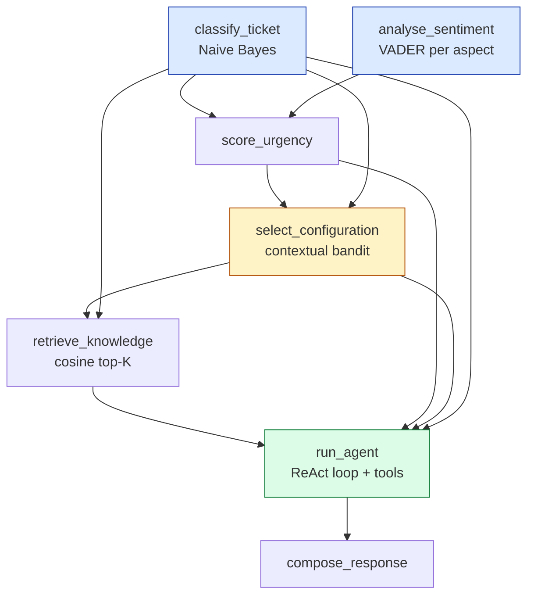
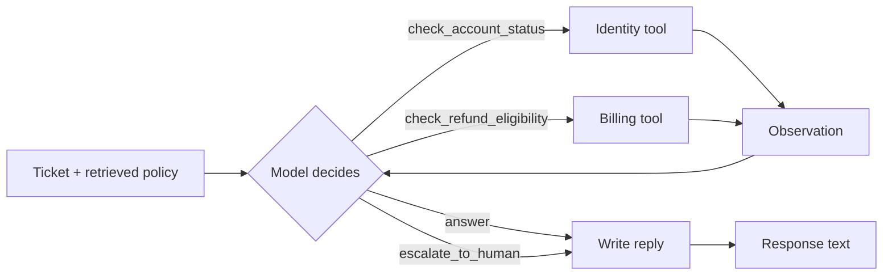

# TicketIQ Architecture

How the pieces fit together, and why each one is built the way it is.
For setup and API usage see the [root README](../README.md).

---

## 1. The shape of the system

TicketIQ is a single FastAPI process holding six components. Nothing is a
microservice; the interesting structure is the **workflow engine**, which turns
the triage steps into a dependency graph rather than one long function.

```
                            HTTP
                              |
        +---------------------+---------------------+
        |                     |                     |
   POST /ticket         POST /feedback     GET /ticket/{id}/status
        |                     |                     |
        v                     v                     v
+-------------------------------------------------------------+
|                      TriageService                          |
|  owns every component and exposes three operations          |
+-------------------------------------------------------------+
        |                     |                     |
        v                     v                     v
+---------------+   +------------------+   +------------------+
| WorkflowEngine|   | Contextual       |   | WorkflowStateStore|
| (DAG runner)  |   | bandit (RL)      |   | (SQLite)          |
+---------------+   +------------------+   +------------------+
        |                     ^                     ^
        |  runs stages        | reward              | reads/writes
        v                     |                     |
+-------------------------------------------------------------+
|  Classifier | Aspect sentiment | Retriever | Agent | LLM     |
+-------------------------------------------------------------+
```

Every arrow that crosses a component boundary carries a plain dictionary, not
an object. That is a deliberate constraint: the workflow engine persists each
stage output as JSON, so anything a stage produces must be serialisable.

---

## 2. The pipeline DAG



The engine groups these into **execution levels** using Kahn's algorithm, where
a level is "everything whose dependencies are already satisfied":

| Level | Stages | Notes |
|-------|--------|-------|
| 0 | `classify_ticket`, `analyse_sentiment` | **run in parallel** on a thread pool |
| 1 | `score_urgency` | needs both level-0 outputs |
| 2 | `select_configuration` | the bandit picks the arm for this state |
| 3 | `retrieve_knowledge` | uses the top-K the bandit chose |
| 4 | `run_agent` | uses the prompt variant the bandit chose |
| 5 | `compose_response` | final customer text |

`GET /workflow/graph` returns this table live, computed from the declared
dependencies rather than written down anywhere.

### Why the bandit sits in the middle of the graph

The configuration cannot be chosen before classification, because the category
and urgency *are* the bandit's context. And it must be chosen before retrieval,
because top-K is one of the things it chooses. That ordering is a real data
dependency, and the engine derives it rather than having it hard-coded.

---

## 3. The workflow engine

Three files, in `app/workflow/`:

| File | Responsibility |
|------|----------------|
| `dag.py` | Graph validation, level computation, parallel execution, resume |
| `state_store.py` | SQLite persistence of ticket rows and stage rows |
| `pipeline.py` | The seven triage stages and the service that owns them |

`dag.py` knows nothing about tickets. It could run any set of named stages.

### What it guarantees

1. **Declared dependencies.** A stage lists what it needs; the engine derives
   the order. A missing dependency, a self-dependency or a cycle is rejected at
   construction time, not at run time.
2. **Parallelism where it is free.** Stages on the same level run on a
   `ThreadPoolExecutor`. Classification and sentiment both only read the raw
   ticket, so they overlap.
3. **Resumability.** Each stage result is written to SQLite as it completes.
   Re-running the same transaction loads completed stages from the store rather
   than re-executing them, so a failed stage can be retried alone.
4. **Honest status.** `GET /ticket/{id}/status` reads the same rows the engine
   writes. It cannot drift out of sync with reality.

### Failure semantics

When a stage raises, the engine records it as `failed`, marks every downstream
stage `skipped`, and returns a result with `succeeded = False`. Upstream stages
stay `completed` and their outputs stay readable. This is what makes the retry
path cheap:

```
first run :  classify [completed]  sentiment [completed]  ...  retrieve [FAILED]  agent [skipped]
retry     :  classify [reused]     sentiment [reused]     ...  retrieve [executed] agent [executed]
```

### Why SQLite and not a dictionary

Feedback can arrive minutes after the answer, possibly after a restart; the
status endpoint must show real mid-flight state; and a failed stage must be
re-runnable. A file that outlives the process satisfies all three, and SQLite
is in the standard library. Each method opens a short-lived connection under a
lock, because stages run on multiple threads.

---

## 4. Classical ML: the classifier

`app/ml/naive_bayes.py` implements Multinomial Naive Bayes directly — the
counting, the Laplace smoothing and the log-probability scoring. No
`model.fit()` from scikit-learn is called anywhere; in fact scikit-learn is not
a dependency at all, because the TF-IDF vectoriser (`tfidf.py`) and the metrics
(`metrics.py`) are also written out by hand.

**The maths, in one place:**

```
score(category) = log P(category) + sum over words of  count(word) * log P(word | category)

                                  count(word, category) + alpha
P(word | category)  =  --------------------------------------------------
                       total words in category + alpha * vocabulary size
```

Log space avoids underflow from multiplying hundreds of small probabilities.
Laplace smoothing (`alpha = 1.0`) stops an unseen word from zeroing a category.
Words outside the training vocabulary are skipped rather than smoothed, so an
unusual word adds no evidence instead of penalising every category equally.

Features are **bag-of-words counts** with the subject line counted twice, since
a support subject is a strong summary of the problem. TF-IDF is used on the
retrieval side, where rarity matters more than raw frequency.

**Model lifecycle.** The dataset is 160 rows, so training takes milliseconds
and happens at process startup. The held-out split produces the quality report;
the model that then serves traffic is retrained on all 160 rows.

---

## 5. Aspect-level sentiment

`app/ml/aspect_sentiment.py` scores each product aspect separately instead of
giving the whole ticket one number:

1. Split the ticket into sentences.
2. For each sentence, match a keyword dictionary to spot aspects
   (`billing`, `login`, `performance`, `reliability`, `support_response_time`,
   `account_management`, `feature_availability`).
3. Score each sentence with VADER; each aspect gets the mean of the sentences
   that mention it, plus the harshest sentence as evidence.
4. Return at most three aspects, most-mentioned first.

**Domain tuning.** VADER was built for social media, and a few words behave
badly on support text. The clearest case: "support" is a *positive* word in the
stock lexicon, so "Support has not replied for days" scored positive. A small
`DOMAIN_LEXICON` neutralises product nouns (`support`, `help`, `please`) and
adds failure words VADER does not know (`timeout`, `outage`, `unusable`,
`nobody`). This is the kind of fix that only shows up by looking at outputs,
which is why the evidence sentence is returned in the API response.

---

## 6. Urgency

A transparent weighted sum, in `app/ml/urgency.py`:

```
urgency = category weight (<= 0.35) + negativity of worst aspect (<= 0.35) + tier weight (<= 0.30)
```

Then bucketed into `low` / `medium` / `high`. A support lead can read this
formula, disagree with a weight, and change one number — which is worth more
here than a learned model trained on data we do not have. The bucket, not the
raw score, goes into the RL state, because a continuous value would create
states that never repeat.

---

## 7. Retrieval (RAG)

| Step | Choice | Why |
|------|--------|-----|
| Chunking | one chunk per `##` section | the knowledge base is written as short self-contained policy sections, so a section is the natural retrieval unit; it never cuts a rule in half |
| Embedding | hand-written TF-IDF sparse vectors | the maths stays visible, and there is no model download |
| Index | in-memory cosine similarity | 28 chunks: brute force is faster than FAISS and adds no native dependency |
| Query | `category + subject + body` | the predicted category is a cheap hint that pulls the search toward the right document |
| Filtering | drop zero-similarity hits | better to return two relevant chunks than pad to five with noise |

The assignment allows FAISS, ChromaDB **or** a basic in-memory cosine index;
this is the third option. `InMemoryVectorStore.search()` has the same shape a
FAISS-backed implementation would, so swapping it would touch one file.

---

## 8. The agentic layer

`app/agent/react_agent.py` runs a ReAct (Reason + Act) loop. Each turn the
model sees the ticket, the retrieved policy and every observation so far, and
must reply with one JSON object:

```json
{"thought": "...", "action": "...", "action_input": {...}}
```



**Safety properties, all tested:**

| Situation | Behaviour |
|-----------|-----------|
| Reply is not parseable JSON | escalate to a human rather than guess |
| Action name is not recognised | downgrade to `answer` |
| `action_input` is not an object | treat as empty |
| Tool called without an identifier | fill it in from the ticket text |
| Model keeps calling tools forever | hard stop at `agent_max_steps`, then escalate |

The full trace — every thought, action and observation — is returned in the API
response and written to the stage output. A triage decision that cannot be
audited is not much use in support operations.

**Tools** (`app/agent/tools.py`) are deterministic fakes: the result is derived
from the identifier by summing its character codes, so the same order id always
gives the same answer and tests need no network. `hash()` is deliberately not
used, since Python randomises it per process.

---

## 9. Reinforcement learning

### Why a contextual bandit

Choosing a pipeline configuration is a **one-step** decision: pick an arm, get a
reward, and the next ticket is unrelated. There is no sequence of states to plan
through, so Q-learning's machinery (discount factors, next-state bootstrapping)
would be dead weight. A contextual bandit is the exact model for "one decision,
immediate reward, right answer depends on context", and it learns from few
samples — which matters when every sample is a real customer interaction.

### State, action, reward

```
state  = category | urgency bucket | customer tier        (4 x 3 x 3 = 36 states)
action = prompt variant x RAG top-K                       (2 x 2 = 4 arms)
reward = (feedback score x 10) - latency in seconds
```

The four arms are real alternatives, not labels: the two prompt variants use
different system instructions *and* different Ollama models, and K=2 versus K=5
changes both the context size and the latency.

### The update rule

```
new_average = old_average + (reward - old_average) / new_count
```

Identical to re-averaging the whole history, without storing it. Selection is
epsilon-greedy with a cold-start rule: every arm is tried once per state before
any average is trusted, then `epsilon = 0.15` of traffic explores and the rest
exploits the best arm.

### Where the loop closes

```
POST /ticket    -> bandit picks arm, pipeline runs, latency + arm + state stored in SQLite
POST /feedback  -> read that row, reward = feedback*10 - latency, bandit.update(), state saved to disk
```

Feedback is applied **once** per transaction (a second attempt returns 409),
because applying it twice would quietly bias the averages. Learning survives a
restart via `var/bandit_state.json`.

### Evidence that it learns

`scripts/simulate_bandit.py` runs the **real** bandit and the **real** reward
function against a simulated world where no arm is globally best. Measured:

| Tickets | Optimal choices, first fifth | Optimal choices, last fifth |
|---------|------------------------------|------------------------------|
| 5,000 | 54.4% | 75.9% |
| 20,000 | 67.7% | **88.8%** |

With `epsilon = 0.15` the theoretical ceiling is about 88.8% (85% exploit + a
quarter of the 15% exploration landing on the best arm by chance), so at 20,000
tickets the bandit is essentially optimal. Average reward per ticket rises from
5.66 to about 6.7 over the same run.

---

## 10. The language model layer

Two backends behind one interface (`app/llm/client.py`):

| Backend | When | What it does |
|---------|------|--------------|
| `OllamaBackend` | a server answers on `/api/tags` | posts to `/api/generate` |
| `TemplateBackend` | no server, or a call fails mid-request | composes the answer from the retrieved chunks, the chosen variant and the tool results |

`TICKETIQ_LLM_BACKEND=auto` (the default) probes once at startup. **Every
response reports which backend produced it**, so template output can never be
mistaken for model output.

The template backend is not a stub returning a fixed string — it reads the
retrieved policy, the prompt variant and the tool results and writes a different
answer for each, including the two visibly different reply shapes. That keeps
the whole pipeline, the latency measurement and therefore the reward signal
meaningful with no model installed, which is what makes the test suite and CI
run offline and deterministically.

---

## 11. Request lifecycle, end to end

```
POST /ticket
  |
  1. transaction id minted, ticket row written              -> SQLite
  2. engine.run()
       level 0: classify_ticket  ||  analyse_sentiment      -> 2 threads
       level 1: score_urgency
       level 2: select_configuration    (bandit: explore or exploit?)
       level 3: retrieve_knowledge      (top-K from the chosen arm)
       level 4: run_agent               (ReAct loop, tools, reply written)
       level 5: compose_response
     each stage row written as it completes                 -> SQLite
  3. latency measured across the whole run
  4. result + arm + state key + latency stored              -> SQLite
  |
  response: category, aspect sentiments, snippets, action, reply,
            config used, reasoning trace, tool calls, latency, transaction id

POST /feedback
  |
  1. look up the stored arm, state key and latency
  2. reward = feedback * 10 - latency
  3. bandit.update(state, arm, reward); statistics saved    -> var/bandit_state.json
  4. feedback + reward recorded on the ticket row           -> SQLite
```

---

## 12. Design decisions at a glance

| Decision | Alternative | Why this one |
|----------|-------------|--------------|
| Hand-rolled DAG runner | Airflow / Prefect / Celery | The assignment asks to see dependency and state reasoning, not orchestrator familiarity. ~150 lines, no broker. |
| SQLite state | in-memory dictionary | Feedback arrives late, status must be real, retries must be cheap. |
| Contextual bandit | Q-learning / deep RL | One-step decision, immediate reward, few samples available. |
| In-memory cosine index | FAISS / ChromaDB | 28 chunks; no native dependency; the maths stays readable. |
| No scikit-learn | sklearn for vectorising/metrics | Allowed but not needed once TF-IDF and the metrics are hand-written; one fewer dependency. |
| Template LLM fallback | fail without Ollama | Tests, CI and review must work on a machine with no model server. |
| Threads, not async, inside the engine | asyncio | The parallel stages are CPU-light Python calls; threads keep the stage functions plain synchronous code. |
